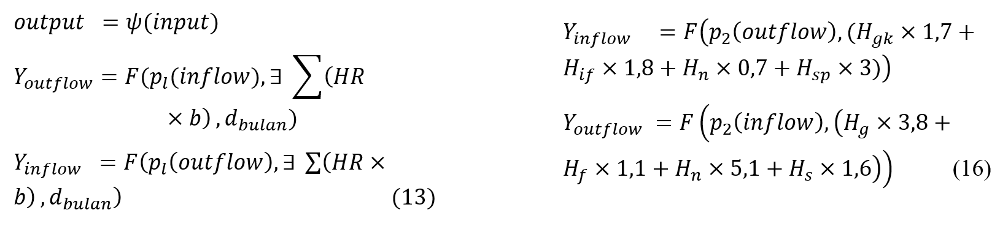

### Forecasting M0 Money Inflow & Outflow in Bali Using Neuro-Fuzzy Modelling

In this paper, we present a novel approach to data-driven neuro-fuzzy modeling, which aims to create accurate monthly inflow and outflow forecast of money (M0) in Bali Province. The data is monthly time series included some religious ceremony identification variables and a monthly dummy variable from January 2011 to March 2019. Well known, Bali Province has unique cultures, the only one province which Hinduism majority religion in Indonesia, and listed as top tourism destination in the world. The neuro-fuzzy models were created using ANFIS architecture and sliding window time series analysis, then simulated using walk forward validation, interpreted using MAPE, and NRMSE. Based on the simulation of the last 24 months, the model of inflow obtained MAPE 23.33% (worth considering) and NRMSE 18.68% (accurate). Meanwhile, the model of outflow obtained MAPE 19.24% (accurate) and NRMSE 8.71% (very accurate). These models and their pieces of information could assist the central bank in Bali Province to prepare cash for money (M0) outflow and managed technic for counting money (M0) inflow.

**Keywords: forecast, inflow and outflow, money, neuro-fuzzy, religious**

#### Mathematical Model

#### Publication 

Publish Date 31 Aug 2021 [https://garuda.kemdiktisaintek.go.id/documents/detail/2220341]
